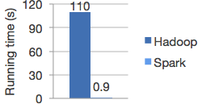

<!-- page_number: true -->
<!-- footer: Introduction à Apache Spark (PySpark) -->

Introduction à Apache Spark (PySpark)
===


##### Principes de bases

###### par [Fabien Barbaud](fabien.barbaud@timeonegroup.com) - [@BarbaudFabien](https://twitter.com/BarbaudFabien)

---

# Apache Spark

## En résumé

**Spark** (ou **Apache Spark**) est un **framework** open source de **calcul distribué**. Il s'agit d'un ensemble d'outils et de composants logiciels structurés selon une architecture définie. Développé à **l'université de Californie à Berkeley** par AMPLab3, Spark est aujourd'hui un projet de la fondation **Apache**. Ce produit est un cadre applicatif de traitements **big data** pour effectuer des **analyses complexes à grande échelle**.
[Wikipedia](https://fr.wikipedia.org/wiki/Apache_Spark)

---

# Apache Spark

## Rapidité

###### Régression logique sur Hadoop VS Spark


100x plus rapide

---

# Apache Spark

## Simple

###### Python

```python
df = spark.read.json("logs.json")
df.where("age > 21")
  .select("name.first").show()
```

Pouvoir rapidement et simplement déployer une application parallélisée de traitement dans les langages Scala, Python, R.

---

# Apache Spark

## Généraliste

###### Stack Spark


Combiner du SQL, du Streaming, du machine learning, ... en une seule application avec Spark

---

# Apache Spark

## Resilient Distributed Datasets (RDDs)

[RDD](https://spark.apache.org/docs/latest/rdd-programming-guide.html#resilient-distributed-datasets-rdds)

---

# Apache Spark

## DataFrames

[DataFrames](https://spark.apache.org/docs/latest/sql-getting-started.html#creating-dataframes)

---

# Apache Spark

## Apache Zeppelin

